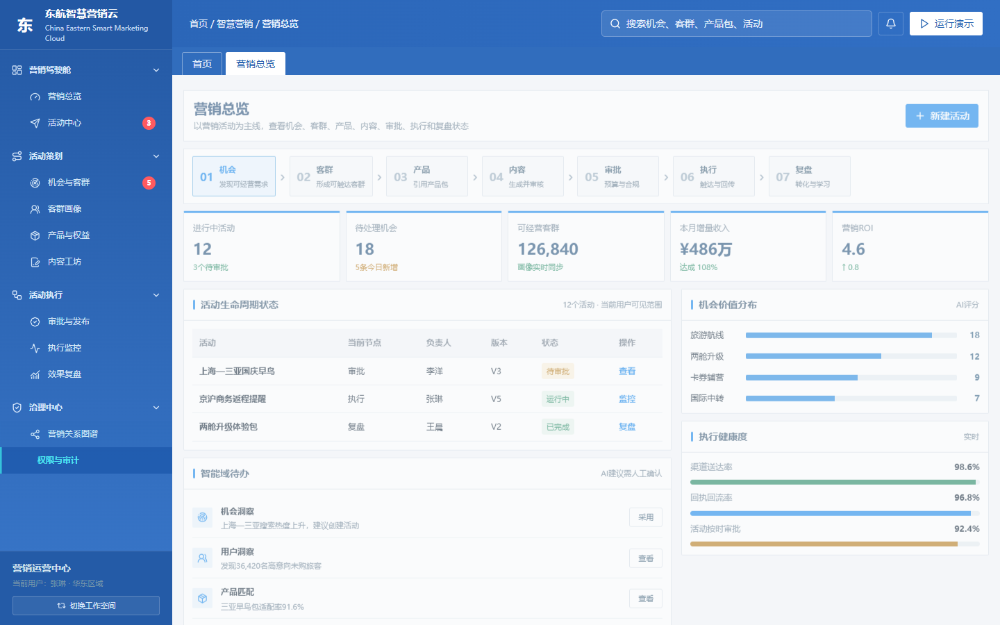
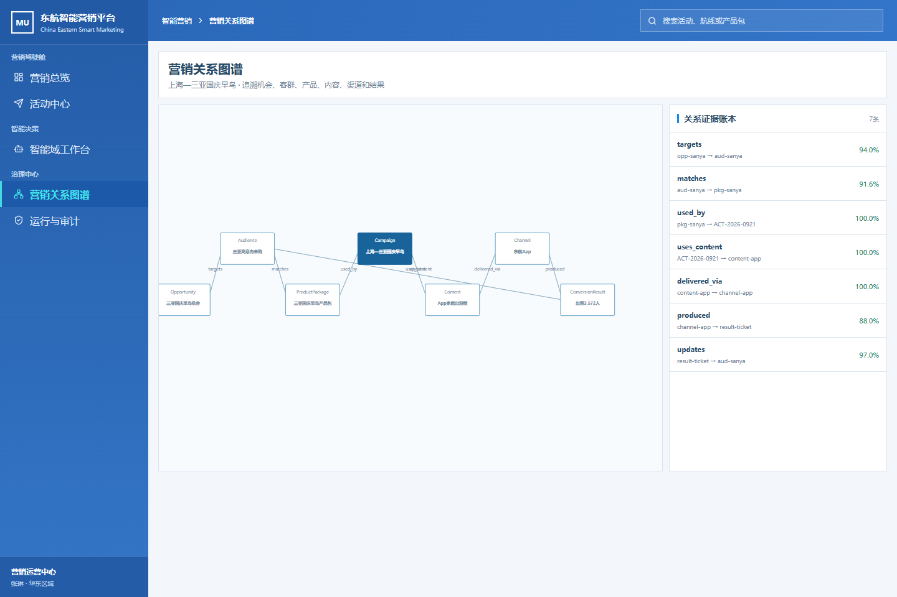
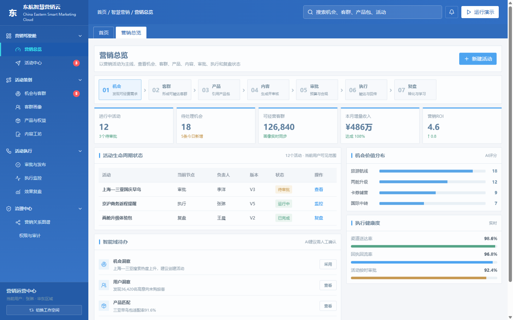

# 东方航空智能营销平台

<p align=center>
  
</p>

**China Eastern Intelligent Marketing Platform**

面向东方航空营销、产品、运营、审批和分析人员的生产级智能营销工作台。平台将航线经营、航班运行、用户画像、市场热点、活动产品和渠道回执连接为一条可治理的营销链路，通过 AI 智能域提供机会发现、客群洞察、产品匹配、内容生成和效果分析能力，同时保留人工审批、权限控制和全链路审计。

> **当前版本**：`v2.7`　|　**部署形态**：Docker Compose + PostgreSQL　|　**后端**：FastAPI　|　**前端**：React / TypeScript + 生产工作台

[](https://github.com/PLiO-LIN/CeairMarketing/actions/workflows/quality.yml)
[](https://github.com/PLiO-LIN/CeairMarketing/actions/workflows/deploy-production.yml)

中文 | [English](#china-eastern-intelligent-marketing-platform)

## 产品定位

平台不是单一的短信群发工具，而是围绕航空营销活动构建的可配置业务系统：

```text
市场 / 航班 / 经营信号
          ↓
机会洞察 → 客群识别 → 产品匹配 → 内容生成 → 审批与合规
          ↓
多渠道触达 → 状态回传 → 转化分析 → 策略学习
```

平台通过产品管理平台获取可售产品包、权益和服务信息，通过用户画像数据获取聚合客群，通过外部市场数据和内部经营数据识别机会，再由营销人员完成最终决策和发布。

## 核心能力

| 能力域 | 生产业务能力 | AI 赋能点 |
| --- | --- | --- |
| 机会工作台 | 航线热度、客座率、提前预订、热点信号、市场机会清单 | 发现异常趋势、归纳机会原因、生成机会建议 |
| 客群工作台 | ToC / ToB 客群、画像指标、标签组合、动态客群包、授权与触达保护 | 自然语言圈选、相似客群扩展、规模和转化潜力评估 |
| 产品包工作台 | 机票、运价、行李、选座、升舱、贵宾室、卡券和辅营产品组合 | 推荐产品包，校验适配性和可售性 |
| 内容工作台 | App、短信、微信等渠道内容版本、事实校验、版本管理 | 生成多渠道内容，适配客群偏好，识别风险表达 |
| 审批与执行 | 预算、产品、客户保护、合规审批，批次执行和渠道回执 | 生成审批摘要、风险提示和异常解释 |
| 效果复盘 | 送达、点击、出票、辅营购买、收入、ROI、回流质量 | 识别高贡献因素、异常规律和策略建议 |
| 知识中心 | 文档、知识片段、本体对象、关系、证据和版本 | 抽取实体关系，建立可追溯的业务语义 |

## 航空营销闭环

1. **机会**：接入外部热点，以及客座率、航线热度、预售和航班运行信号，识别旅游航线、国际中转、两舱升级、卡券和辅营机会。
2. **客群**：复用内部画像指标和标签接口，组合会员等级、历史航线、购买行为、旅程阶段、价格敏感度和 ToB 企业属性，形成聚合客群包。
3. **产品**：从产品管理平台引用活动产品包，覆盖客票与运价、空铁联运、东方万里行权益、预付费行李、优选座位、贵宾室、保险和其他辅营服务。
4. **内容**：根据客群、产品事实、航线和渠道生成内容版本，支持人工编辑、版本对比和事实校验。
5. **审批**：执行预算、产品可售、客户授权、触达频控、敏感词和内容事实检查，按角色和数据范围完成多级审批。
6. **执行**：按渠道、时间窗和批次分发，回传送达、点击、出票、购买、退订、失败和异常状态。
7. **复盘**：关联活动、客群、产品、内容、渠道和结果，分析转化与收入贡献，形成策略学习建议。

## 六个 AI 智能域

AI 输出以建议、解释和可执行结果为主，关键动作保留人工确认：

- **机会洞察智能域**：融合市场热点、航线经营和航班运行数据，识别需求变化、供给机会和异常规律。
- **客群洞察智能域**：理解画像指标和标签语义，支持自然语言圈选、客群关系扩展、规模评估和触达保护。
- **产品匹配智能域**：基于机会、客群需求、航班、运价、库存、权益和辅营属性，生成候选产品包及匹配理由。
- **活动编排智能域**：将机会、客群、产品、内容、预算、渠道和时间组合为活动草案，校验前置条件。
- **内容生成智能域**：生成适配 App、短信、微信等渠道的内容版本，引用产品事实并支持审核留痕。
- **效果分析智能域**：分析触达、互动、出票、辅营购买、收入和 ROI，输出异常解释和策略学习建议。

## 本体与知识中心

知识中心统一管理营销文档、数据证据、本体对象和业务关系。本体覆盖并串联：

```text
数据源 → 机会 → 客群 → 产品包 → 内容 → 营销活动
                              ↓
              审批 → 执行 → 回执 / 转化 → 复盘
```

本体对象携带来源、证据、置信度、有效期、租户和版本信息。数据处理智能体会先解析、清洗、分类和抽取实体关系，再判断内容是否适合进入本体：与业务对象和营销生命周期有关且证据充分的内容进入本体候选；仅供检索参考的内容保留在知识层；低置信度或无法归属的内容进入人工确认队列。

## 数据处理流水线

```text
文件 / API / 数据库
        ↓
接入登记与校验
        ↓
文档解析（MinerU）或结构化读取
        ↓
数据处理智能体：清洗 → 抽取 → 分类 → 实体对齐 → 关系判断
        ↓
知识片段 + 本体候选 + 证据溯源
        ↓
人工确认 / 自动入库
        ↓
机会洞察与六个智能域调用
```

已支持航空数据管道对 `Airport`、`Route`、`Flight`、`FlightSegment`、`Cabin`、`Fare`、`ProductLabel`、`ProductGroup`、`Product` 和 `AncillaryProduct` 等对象进行标准化，并保留来源、有效时间和置信度信息。

## 系统架构

```text
┌──────────────────────────────────────────────────────────┐
│  营销工作台：机会 / 客群 / 产品 / 内容 / 审批 / 执行 / 复盘  │
├──────────────────────────────────────────────────────────┤
│  AI 智能域：机会洞察 · 客群洞察 · 产品匹配 · 活动编排        │
│             内容生成 · 效果分析 · 数据处理智能体             │
├──────────────────────────────────────────────────────────┤
│  知识底座：知识文档 · 本体对象 · 关系 · 证据 · 版本 · 审计     │
├──────────────────────────────────────────────────────────┤
│  数据接入：市场热点 · 航班运行 · 航线经营 · 用户画像          │
│             产品管理平台 · 渠道回执 · 文件 / API / 数据库     │
├──────────────────────────────────────────────────────────┤
│  平台基础：FastAPI · PostgreSQL · 统一 Harness · Docker       │
└──────────────────────────────────────────────────────────┘
```

## 界面预览







## 代码结构

```text
.
├── apps/web/                         React + TypeScript 源码前端
├── apps/web-v32/                     当前 Docker 生产工作台
├── services/platform-api/            FastAPI、智能体、本体和数据管道
├── docs/                             业务、架构和数据处理方案
├── .github/workflows/                质量检查与生产部署流水线
├── compose.yml                       PostgreSQL、API、Web 编排
└── scripts/                          生产检查脚本
```

## 本地开发

环境要求：Node.js 22+、pnpm、Python 3.12+、PostgreSQL 16 和 Docker Desktop。

```powershell
# API
cd services/platform-api
python -m venv .venv
.\.venv\Scripts\Activate.ps1
pip install -r requirements.txt
python -m uvicorn app.main:app --reload --port 8800
```

```powershell
# React 前端
cd apps/web
pnpm install
pnpm dev --host 127.0.0.1 --port 8780
```

完整容器系统：复制 `.env.example` 为 `.env`，填写本地数据库、管理员和模型服务配置后执行：

```powershell
docker compose up -d --build
```

生产工作台默认映射到 `http://localhost:8088`。

## 模型与 MinerU 配置

模型服务使用 OpenAI 兼容接口，可在管理员配置中维护服务名称、Base URL、模型名称和 API Key，并按租户隔离。MinerU 用于文档解析和版面结构化。

```env
BOOTSTRAP_MODEL_BASE_URL=https://api.example.com/v1
BOOTSTRAP_MODEL_NAME=your-model-id
BOOTSTRAP_MODEL_API_KEY=
BOOTSTRAP_MINERU_BASE_URL=https://mineru.net
BOOTSTRAP_MINERU_API_KEY=
```

请勿将真实 API Key、数据库密码、SSH 私钥或 `.env` 提交到代码库。

## 测试与质量检查

```powershell
cd apps/web
pnpm run build
cd ../..
node --check apps/web-v32/app.js
node --check apps/web-v32/production.js
node --check apps/web-v32/market-hotspots.js
node scripts/check-production-copy.mjs
cd services/platform-api
python -m pytest -q
```

## CI/CD

推送到 `main` 会触发 `quality.yml` 和 `deploy-production.yml`。质量流水线执行前端脚本检查、生产文案检查、空白检查和 API 测试；部署流水线通过 SSH 发布到腾讯云，保留服务器 `.env`，重建 Docker Compose，并在健康检查通过后切换版本。

生产环境需要在 GitHub `production` Environment 中配置 `DEPLOY_HOST`、`DEPLOY_PORT`、`DEPLOY_USER` 和 `DEPLOY_SSH_KEY`。详细说明见 [`docs/deployment-ci-cd.md`](docs/deployment-ci-cd.md)。

## 多人协作

- `main`：生产分支，不直接开发。
- `develop`：集成分支。
- `feature/<scope>-<name>`：功能开发。
- `fix/<scope>-<name>`：缺陷修复。

提交消息遵循 Conventional Commits，例如 `feat(campaign): add campaign editing and deletion`。完整规则见 [`CONTRIBUTING.md`](CONTRIBUTING.md)。

## 文档

- [`VERSION.md`](VERSION.md)：版本变更记录。
- [`CONTEXT.md`](CONTEXT.md)：项目上下文和运行约束。
- [`docs/市场热点智能体与本体处理方案v1.0.md`](docs/市场热点智能体与本体处理方案v1.0.md)：市场热点处理方案。
- [`docs/航班及产品数据管道方案v1.0.md`](docs/航班及产品数据管道方案v1.0.md)：航班和产品数据管道方案。

---

<a id=china-eastern-intelligent-marketing-platform></a>

## China Eastern Intelligent Marketing Platform

Production-oriented marketing operations platform for China Eastern airline teams. It connects market signals, flight operations, aggregated customer profiles, airline products, campaign content, approval, channel execution, feedback and performance learning in one governed workflow.

### Highlights

- Opportunity discovery from market hotspots, route demand, seat load, advance purchase and flight-operation signals.
- Audience intelligence for ToC and ToB segments, reusable profile indicators, natural-language selection and contact protection.
- Product matching for fares, flights, air-rail products, loyalty benefits, baggage, seats, lounges, insurance, coupons and ancillary services.
- Campaign operations covering content versions, approval, compliance checks, scheduled delivery, batch monitoring and feedback.
- Six intelligent domains for opportunity insight, audience insight, product matching, campaign orchestration, content generation and effect analysis.
- Knowledge and ontology governance with evidence, confidence, provenance, effective time, versioning and human confirmation.

### Quick start

```powershell
docker compose up -d --build
```

Tenant isolation, role-based access, protected customer data, audit records and human approval are part of the platform contract. Keep secrets in environment variables or administrator-managed encrypted configuration; never commit them to Git.

## 内部使用说明

本仓库用于经授权的东方航空项目开发与内部评估。接入生产数据源或发布营销活动前，请完成相应的业务、数据安全和部署审批。


## NDC 24.1 联调

仓库内置安全的虚构 NDC 24.1 航班、运价、订单和辅营产品接口，用于联调数据处理智能体与本体人工确认流程。详见 docs/ndc24-integration-simulation-v1.0.md。
