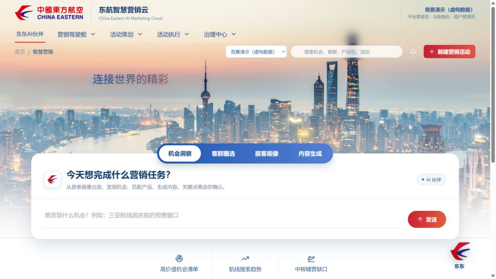

# v3.16 竞赛演示与标准接口

本轮围绕东航用户画像与智能营销竞赛加强流程闭环、AI 结果落地和上游接口。真实画像、产品及交易系统的接口资料尚未提供；本版本提供聚合数据契约和可独立运行的虚构案例。

v3.16 的现场操作与验证范围见 [演示手卡](demo-runbook-v3.16.md)；本文保留标准接口约定。

## 启动与登录

先按 README 安装 Python、Node.js 和 API 依赖，在工程根目录运行：

```powershell
.\start-competition.ps1
```

| 项目 | 入口或配置 |
| --- | --- |
| 竞赛工作台 | http://127.0.0.1:8781/ |
| API 与在线文档 | http://127.0.0.1:8801/docs |
| 就绪检查 | http://127.0.0.1:8801/health/ready |
| 本地竞赛账号 | `competition` / `Competition@2026` |
| 登录后选择的工作区 | `CEA-COMPETITION`，竞赛演示（虚构数据） |
| 本地独立数据库 | `services/platform-api/ceair-competition.db`，被 Git 忽略 |
| API 启动日志 | `services/platform-api/competition-api-8801-error.log`（随 API 端口变化） |

脚本只监听本机地址，使用独立 SQLite 文件并等待 API、页面就绪。重复启动会保留已演示的状态；初始化使用稳定对象标识，不重复插入案例。从头排练可选择一对空闲端口，创建新数据库而保留旧状态：

```powershell
.\start-competition.ps1 -NewRehearsal -ApiPort 8803 -WebPort 8783
```

`SEED_DEMO_BUSINESS_DATA` 默认是 `false`。在独立的 Compose 演示环境中可显式设为 `true`，登录该环境已配置的管理员账号后选择竞赛工作区。Compose 的数据库、生产校验和凭据仍按 `.env` 配置。

## 首页与工作区

首页参考[东航官网](https://www.ceair.com/zh/cny/home)的品牌导航、宽幅城市主视觉、蓝色分段卡和红色行动按钮，统一标志尺寸、文字层级、卡片留白与快捷入口。四个任务页签支持机会洞察、客群圈选、旅客画像和内容生成。

工作区选择器位于页面顶部搜索框左侧，只展示登录账号获授权的租户。切换工作区后重新加载当前租户数据；刷新时保留选择。答辩前确认选中“竞赛演示（虚构数据）”。



## 答辩演示流程（约 6 分钟）

1. **画像与机会**：展示画像字段目录、预置客群组合和“上海—三亚国庆早鸟”机会，说明画像字段、客群包与客群快照的区别。
2. **客群与产品**：打开“三亚高意向未购客群”、冻结快照和早鸟产品包。案例的 36,420 人、32% 热度变化等数值均为虚构流程数据。
3. **内容生成**：在内容工坊选择活动、客群、产品和渠道，输入“突出行李权益，不使用最低价表述”，点击生成。检查结果与业务依据，再点“确认并保存草稿”；生成后直接退出不会新增内容资产。
4. **审批治理**：查看预置 V3 版本及其快照、产品和内容依据，处理待审批任务。只有批准后才生成执行批次。第 3 步新生成的草稿独立保存；如需用于执行，需另建活动版本并重新审批。
5. **执行与复盘**：进入执行监控，点击“执行联调”产生虚构渠道回执；查看送达、点击、转化和失败统计。收入、ROI 保持“待回流”，不会根据虚构转化人数推算真实收入。
6. **标准接入与溯源**：在客群或产品页点击“同步业务数据”，导入下文 JSON；查看新增对象及导入记录，再重复导入说明重复识别。知识中心可查看竞赛案例口径和业务关系。

默认“竞赛流程验证模型”为受控测试模型，用于验证输入、结果保存、人工确认、审批和回流。接入业务大模型后，内容须返回有效的 `title`、`body`，圈选须使用已注册字段；模型建议不能代替上游画像系统计算的真实人数。

## 接口通用约定

可直接导入的示例文件：[聚合客群](examples/competition-audiences.json)、[产品包](examples/competition-products.json)。

请求体使用 UTF-8 JSON。先调用 `POST /api/auth/login` 获取 `access_token` 与租户列表；后续请求带 `Authorization: Bearer <access_token>` 和 `X-Tenant-ID: <当前租户数字 ID>`。数字 ID 从登录响应取得，不能用 `CEA-COMPETITION` 编码代替。两个同步接口均要求当前租户管理员权限。

- 每批 1–200 条记录，`source_id` 为 1–32 个字符，`external_id` 为 1–64 个字符，均仅允许英文字母、数字、下划线和连字符。
- 上游标识按“租户 + 对象类型 + source_id + external_id”映射到稳定对象。相同内容重复同步计入 `unchanged`，不重复新增。
- 字段、重复标识或有效期有误时整批拒绝，已处理行也不落库。
- 成功返回 `batch_id`、`source_id`、`total`、`created`、`updated`、`unchanged`，并保存来源与导入批次。

| 状态码 | 含义 |
| --- | --- |
| 200 | 同步完成，查看新增、更新及未变化数量 |
| 401 / 403 | 未登录或当前租户权限不足 |
| 409 | 来源停用，或已冻结/被审批引用的对象不允许覆盖 |
| 422 | 字段、条件、批内重复标识或日期校验失败 |

### 聚合客群同步

`POST /api/integrations/profile/audiences`

```json
{
  "source_id": "profile_platform",
  "records": [
    {
      "external_id": "SH_FAMILY_202610",
      "name": "上海家庭出游聚合客群",
      "estimated_size": 1200,
      "conditions": [
        {"field_code": "province", "operator": "eq", "value": "上海"},
        {"field_code": "gender", "operator": "in", "value": ["男", "女"]}
      ]
    }
  ]
}
```

`conditions` 为 1–40 条，`operator` 支持 `eq`、`ne`、`in`、`gte`、`lte`；字段须存在于当前租户的 `GET /api/persona-dimensions` 目录。`estimated_size` 为上游提供的非负整数，不由语言模型补造。同步后客群包状态为“可用”；使用活动执行前仍需冻结快照。

接口不接收旅客列表、姓名、会员编号、证件号、手机号或邮箱等个人明细及身份条件。已冻结、已使用、执行中或已归档的客群包不能被覆盖，应改用新的上游标识。

### 产品包同步

`POST /api/integrations/products/packages`

```json
{
  "source_id": "product_platform",
  "records": [
    {
      "external_id": "SANYA_BUNDLE_202611_V1",
      "name": "上海—三亚出游产品包",
      "product_type": "机票 + 辅营组合",
      "description": "客票、预付费行李与优选座位组合，具体权益以产品规则为准。",
      "eligibility": "适用航线 SHA-SYX；航班与库存由上游确认。",
      "version": "V1",
      "valid_from": "2026-11-01T00:00:00+08:00",
      "valid_to": "2026-12-01T00:00:00+08:00"
    }
  ]
}
```

同步后产品状态为“草稿”，便于人工核验；同步不等于产品已审批或实时可售。提供有效期时，结束必须晚于开始。被待审批、已通过或执行活动版本引用的产品不允许覆盖，应使用新的 `external_id` 保留历史依据。

### 成功响应示例

```json
{
  "batch_id": "SYNC-XXXXXXXXXXXX",
  "source_id": "profile_platform",
  "total": 1,
  "created": 1,
  "updated": 0,
  "unchanged": 0
}
```

## 数据与效果口径

竞赛案例、测试模型和渠道联调只验证业务流程，不代表东航实际旅客、价格、库存、经营热度或营销收益。活动效果接口返回 `execution_mode: "synthetic"`，前端明确显示“虚构回执（流程验证）”。当前效果统计使用所选活动的最新执行批次；送达为渠道任务计数，不能作为跨渠道去重旅客人数。

真实系统后续需提供字段口径、身份授权、上游计算与冻结能力、产品可售规则、渠道回执及交易归因契约。本版本已提供聚合导入、租户权限、结果确认、审批和来源追踪入口；交易收入与 ROI 需有实际回流依据才能接入。
