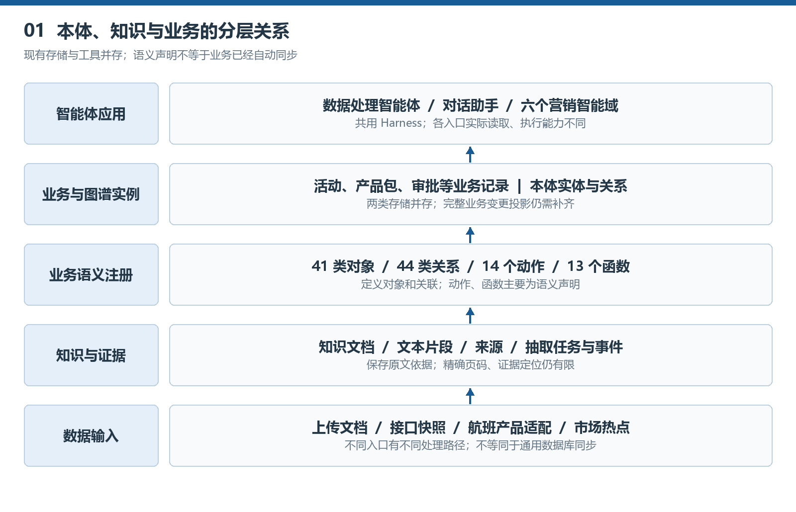
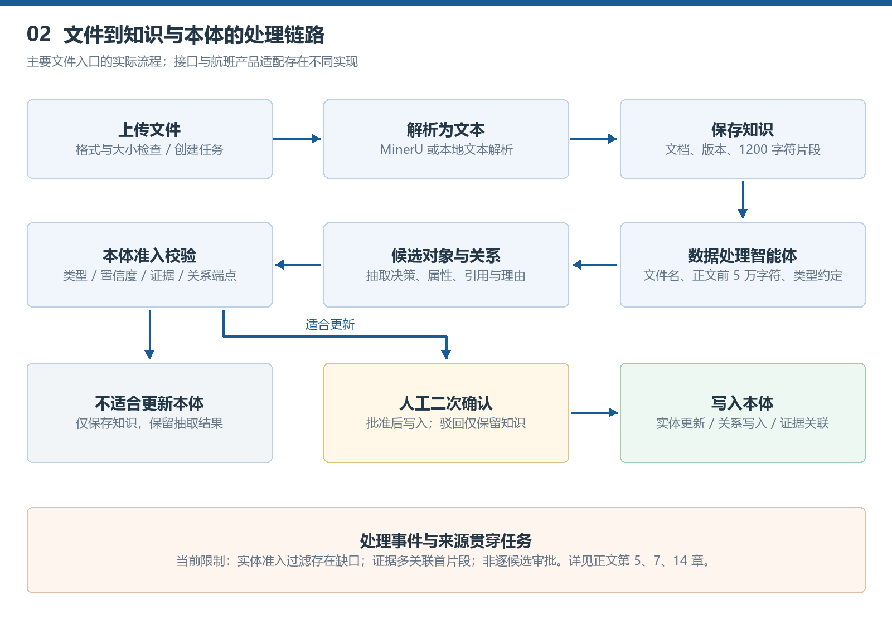
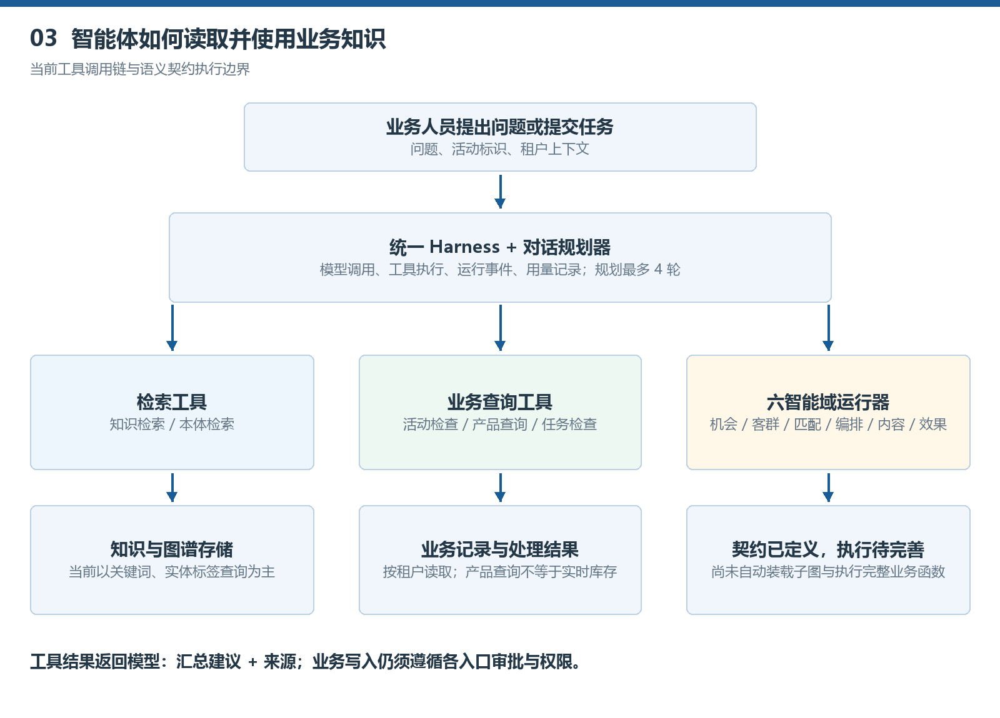

# 东方航空智能营销平台：本体结构与数据解析及智能体驱动说明 v1.0

文档日期：2026年9月20日

适用对象：业务负责人、产品经理、数据工程师、后端工程师、智能体开发人员及系统评审人员。

核对范围：当前本地 `东方航空智能营销平台_v1.0` 工作区。仓库基线为 `d4fc0e6`，同时包含本地未提交的业务编辑改造。本说明不是线上部署验收报告，也不代表远程环境已运行相同代码。

文档版本与本体版本分别管理：本文为 **v1.0**；代码中语义模型版本为 **ceair-marketing-ontology-v1.1**。

> 阅读原则：本文将“当前已执行的机制”“代码中已声明的语义设计”“建议补齐的生产能力”明确区分。图中的目标闭环不等于所有环节已自动打通。业务案例中的航线、活动、产品和数值均为说明性示例，不代表真实经营数据。

## 1. 先回答五个核心问题

### 1.1 平台里的本体究竟是什么

本体是平台对航空营销业务的统一表达方式：规定有哪些业务对象、对象有哪些属性、对象之间允许什么关系，以及哪些业务动作可以改变对象状态。

例如，平台不能只保存一段“上海至三亚适合开展亲子营销”的文字，还应能明确这段判断涉及哪条航线、使用了什么时间窗口的经营指标、针对哪个客群、推荐哪些产品包、由谁确认、最后形成哪个活动版本。这样，知识才不仅可阅读，还可检索、可关联和可追溯。

当前实现可以概括为：**业务语义注册表 + 租户隔离的实体关系存储 + 知识文档及片段 + 数据处理任务 + 智能体工具调用**。它不是一个独立的推理数据库，也不是把所有业务表自动变成了图谱。

### 1.2 本体和知识库是什么关系

知识库保留“原文怎么说”，本体表达“这句话说的是谁、与什么有关”。两者在知识中心共同提供能力，但物理存储分开。

例如，“贵宾室券仅在指定机场、指定日期可用”的服务说明，原文及上下文保存在知识文档中；产品对象、有效期、适用条件及其与活动的关系，应在本体及业务数据中表达。内容生成智能体据此避免把限定权益写成无限制承诺。

**不是所有知识都必须进入本体。** 一般写作方法、通用营销经验、无法确认对象的宣传材料可以只做知识检索材料。只有能稳定映射到业务对象、具有证据且通过准入与审核的内容，才适合形成正式图谱对象。

### 1.3 数据怎样进入本体

文件先被解析为文本并保存成知识，再由数据处理智能体抽取候选对象和关系，执行准入校验，符合条件后等待人工确认。人工确认通过才执行本体写入；驳回时保留知识文档。

航班、舱位、运价等结构化数据还有专门的确定性适配器，按字段映射生成候选对象，不需要让大模型猜测航班号或价格。市场热点也有独立的采集、分类与本体确认链路。

### 1.4 智能体如何使用本体

理想方式不是把整张图一次性塞入提示词，而是让智能体通过受控工具按需查询：定位业务对象，沿关系获得相关产品、规则和证据，再生成带引用的建议。

当前平台对话助手已经有知识检索、本体检索、活动检查、产品查询、流水线检查及调用智能域六类工具。六个营销智能域也已定义各自读写契约，但通用智能域运行器尚未依据契约自动检索完整业务子图，不能理解为六域都已经具备完整的图推理能力。

### 1.5 业务是否已经由本体全自动驱动

尚未达到全自动闭环。当前是**业务交易数据与图谱数据并存，部分流程使用本体，更多语义已经定义、执行连接仍需补齐**。

活动创建、版本、审批、执行批次和回执主要由业务 API 与业务表驱动。本体中定义了这些对象，不意味着每次业务变更都会自动同步产生相应节点、关系和历史版本。这个区别直接影响智能体能否看到最新、完整、可执行的业务上下文。

## 2. 全局结构：五种层次不要混淆



| 层次 | 在平台中的含义 | 当前实现及边界 |
| --- | --- | --- |
| 原始输入层 | 文件、接口快照、热点及上游系统数据 | 文件上传、提交接口数据、航班产品适配、热点采集存在；通用数据库连接器未在本次代码中发现 |
| 知识内容层 | 文档正文、切片、来源、分类 | 有独立文档表和片段表；当前文件链路未见原始二进制对象存储 |
| 业务语义层 | 对象类型、属性、关系、动作及函数约定 | Python 注册表，41 类对象、44 类关系、14 个动作声明、13 个函数声明 |
| 实例与业务层 | 图谱里的具体对象，以及真实活动、产品包、审批等业务记录 | 图谱实体关系表与业务表分别存储，尚缺统一的业务变更投影机制 |
| 智能体应用层 | 数据处理、对话助手、六个营销智能域 | 共用自研 UnifiedHarness；工具与语义契约的执行完整度不同 |

上述数量是语义定义数量，不是当前租户的实例数量，更不是已上线功能数量。

### 2.1 本体结构与本体实例

“本体结构”回答：系统允许表达什么。例如，`Campaign` 表示营销活动，`CampaignVersion` 表示活动版本，`has_campaign_version` 表示活动拥有版本。

“本体实例”回答：当前租户实际有哪些对象。例如，某一个秋季企业差旅活动、其 V2 版本、所选产品包以及对应审批任务。

当前本体结构由 `semantic_model.py` 中的常量维护，是应用级定义，不是每个租户独立维护的一套可视化 Schema。实例则通过 `tenant_id` 隔离。页面切换结构图与实例图，不会自动修改语义模型，也不会自动创建缺失实例。

### 2.2 定义、实例、业务记录的三方一致性

一个对象可能同时出现在三个位置：语义定义中的 `ProductPackage`，图谱实例中的某个产品包节点，以及业务表 `product_packages` 中的一行记录。三者角色不同。

业务表负责真实编辑、引用和流程状态；图谱负责关系发现和关联查询；语义定义负责统一含义。若没有同步机制，业务表改了产品包名称或有效期，图谱不一定同步变化，智能体可能读取到旧信息。

因此，当前不能把“图上能看到某产品包”视为它一定可以销售，也不能把“业务页面新增成功”视为图谱已经完整同步。生产方案应明确权威数据源和更新事件，详见第12章。

## 3. 本体对象怎么划分

### 3.1 航空事实与市场信号

| 对象 | 主要职责 | 业务解释 |
| --- | --- | --- |
| MarketSignal | 保存外部市场信号 | 目的地热度、假期信息、搜索或舆情信号，不直接等同营销机会 |
| Market | 表示经营市场 | 国内、国际及地区、城市或目的地区域 |
| Airport、Route | 表示机场与航线 | 区分机场代码和城市概念，避免将城市对与机场对混为一谈 |
| Flight、FlightSegment | 表示航班与航段 | 一个组合行程可能有多个实际飞行航段 |
| Cabin、Fare | 表示舱位与运价 | 舱位与运价不同，价格还与旅客类型、产品、税费及规则有关 |
| MetricObservation | 保存带时间的观测 | 客座率、正常率、库存、收入等应带观测时间和口径 |

例如，航线是相对稳定的对象，“未来两周客座率较低”是一个时间窗口中的观测，不应反复覆盖航线本身的全部属性。此处是语义建模原则；当前适配器并未全面实现时态观测与价格历史管理。

### 3.2 客户、需求、标签与客群

`CustomerAggregate` 表示聚合客户，不要求把个人旅客明细给模型。`CustomerNeed` 表示业务需求，例如出行便利、费用确定性或舒适性。`ConfigurableAttribute` 表示来自内部画像接口、运营维护或模型建议的可配置属性。`AudienceSnapshot` 表示一次活动引用的固定客群版本。

不要把三层合并：**底层画像条件用于圈选，客群包组织条件，客群快照固定执行口径。** 平台业务表中已经有画像维度、画像规则、标签、客群包和快照；当前语义模型并没有单独注册名为 `AudiencePackage` 的对象类型，不能在图谱说明中假定它已经存在。

标签取值不应写死在本体结构中。需要固定的是属性编码、数据类型、来源、解释口径和有效性要求；具体标签可复用已有接口，也可由运营管理。当前 `ConfigurableAttribute` 及属性注册主要为声明层，尚非全面执行的数据类型校验器。

### 3.3 产品、产品包与价值主张

`Product` 是基础活动产品；`ProductPackage` 是供活动引用的组合；`AncillaryProduct` 承载行李、选座、贵宾室等辅营；`ProductLabel` 与 `ProductGroup` 对应源系统产品标签和分组。运价另由 `Fare` 表达。

产品不局限机票，还应覆盖空铁联运、辅营、卡券和会员权益。当前注册表没有独立的 `Coupon`、`MemberBenefit` 类型，相关对象应优先用 `Product` 及 `product_type` 表达，或经过正式语义扩展后再使用新类。

`ValueProposition` 不是产品事实，而是基于客群需求对产品利益的表达。例如，同一产品包对亲子客群强调出行方便，对 SME 企业差旅强调费用可控。智能体可以建议价值主张，但不能凭空增加权益。

产品创建、审批、服务和交付仍由产品相关业务及上游产品管理平台负责。本体用于表达引用和限制条件，不应替代权威库存、价格与履约系统。

### 3.4 营销主线与活动版本

| 对象 | 作用 | 与相近对象的区别 |
| --- | --- | --- |
| Opportunity | 可经营机会 | 信号经过业务评估之后的候选机会，不是外部新闻本身 |
| MarketingObjective | 量化目标 | 例如辅营转化目标、客座率目标，不等同活动名称 |
| MarketingCase | 跨流程的经营事项 | 用于串联多次活动或多次方案调整，当前主要是语义层概念 |
| StrategyPlan | 策略方案 | 解释为何选这类客群、产品和投入方向 |
| TouchpointPlan | 触点计划 | 表达触点、时间窗口、频次及内容引用 |
| Campaign、CampaignVersion | 活动及活动版本 | 活动是主记录；版本固定本次要审批、执行的配置 |
| ContentAsset | 渠道内容 | 文案、标题、正文、版本及生成来源 |

版本是业务闭环的关键。审批应该审批一套明确的客群、产品、内容和渠道配置，执行应该执行被批准的版本，而不是临时读取已经变化的“最新配置”。当前业务表存在活动版本与客群快照，但产品、内容的版本留存及其图谱映射仍需完整治理。

### 3.5 执行、反馈、归因与治理

执行相关对象包括 `ApprovalTask`、`ExecutionBatch`、`Channel`、`Feedback`、`AttributionResult` 和 `Review`。其中回执是事实，归因是采用一定方法对效果来源进行解释，复盘是基于目标及结果形成下一轮建议。

治理相关对象包括 `BusinessRule`、`Evidence`、`HumanDecision`、`Recommendation` 和 `AgentRun`。业务规则与模型建议要分开：模型提出“适合投放”不等于规则校验通过，`needs_approval` 状态也不等于已经创建了真正的审批任务。

知识对象包括 `KnowledgeDocument`、`KnowledgeChunk`、`KnowledgeClaim`。目前前两者有知识表及可选图谱节点；`KnowledgeClaim` 主要是语义定义，尚未形成完整的事实断言管理服务。

## 4. 属性、关系、标识与版本如何表达

### 4.1 实体实例的实际存储

本体实例使用 SQLAlchemy 的 `OntologyEntityRecord`，核心字段如下。

| 字段 | 含义 | 使用时要注意 |
| --- | --- | --- |
| id | 数据库内部主键 | 不建议作为跨系统业务标识 |
| tenant_id | 租户 | 必须与登录用户授权租户一致 |
| external_id | 对外业务标识 | 与 tenant_id 联合唯一，用于实体更新与关联 |
| entity_type | 对象类型 | 如 Route、Product、Campaign |
| label | 展示名称 | 是展示字段，不宜作为唯一键 |
| attributes_json | 扩展属性 | 当前为 JSON 文本，不是自动受类型 Schema 约束的列 |
| source | 来源 | 文件链路一般为 data-pipeline:任务编号 |
| confidence | 置信度 | 表示抽取或映射估计，不是经统计校准的真实准确率 |
| import_job_id | 导入任务引用 | 主要用于传统导入链路，不能替代所有流水线血缘 |
| updated_at | 最近更新时间 | 不是完整变更历史 |

关系实例 `OntologyRelationRecord` 保存租户、源实体内部主键、关系类型、目标实体内部主键、证据、来源、置信度和创建时间。

当前实体按“租户 + external_id”更新，意味着同标识的新记录可能覆盖属性及来源。它不是保留所有历史版本的时态图数据库，也没有自动解决多个数据源之间冲突的事实合并引擎。

### 4.2 关系有方向，而且两端类型有约束

| 关系示例 | 正确表达 | 意义 |
| --- | --- | --- |
| operates_on | Flight → Route | 某航班执飞某航线 |
| has_segment | Flight → FlightSegment | 航班对象包含具体航段 |
| has_fare | Cabin → Fare | 某舱位对应运价选项 |
| contains_product | ProductPackage → Product | 产品包包含基础产品 |
| targets_audience | Campaign → AudienceSnapshot | 活动面向一个固定客群版本 |
| has_campaign_version | Campaign → CampaignVersion | 活动拥有方案版本 |
| requires_approval | CampaignVersion → ApprovalTask | 某版本需要审批 |
| produces_feedback | ExecutionBatch → Feedback | 执行产生反馈 |
| contains_chunk | KnowledgeDocument → KnowledgeChunk | 文档包含可检索片段 |
| evidence_for | KnowledgeChunk → 业务对象 | 原文片段提供业务证据 |

`validate_relation_endpoints()` 会校验已注册关系两端的类型。但当前对未注册关系返回通过，以兼容历史或扩展关系。因此这是“注册关系类型约束 + 扩展容忍”，并非严格的全局白名单。

举例：热点启发式逻辑使用了 `concerns_market`，该关系并不在当前44类关系注册表中。系统可能出现实例有关系而结构注册表未包含它的情况，这应通过扩展注册或统一映射消除，不应在文档中描述为完全一致。

### 4.3 稳定标识如何产生

结构化适配器对产品使用源产品编码，对机场使用机场代码，对其他对象使用字段组合的 SHA-256 摘要生成稳定标识。这样相同输入通常能得到相同对象编号。

但当前字段组合不是覆盖所有业务情况的统一主数据标准。例如，航班缺少源 `flightInfoId` 时的后备标识没有完整表达出行日期；运价标识也没有体现所有动态价格口径。生产上应进一步明确承运人、航班号、运行日期、航段、旅客类型、渠道、产品及报价版本等身份维度。

文件抽取中的 external_id 主要来自模型输出，缺失时落库函数还有随机标识回退。不能将它与结构化适配器的稳定标识能力混为一谈。

## 5. 文件数据解析：实际每一步做什么



### 5.1 上传、排队与后台执行

文件入口为 `POST /api/data-pipelines`，使用 multipart 文件上传。当前代码接受 TXT、MD、JSON、CSV、PDF、图片、Word、PPT、Excel 和 HTML 等扩展名，大小限制为20MB。

接口创建 `DataPipelineJobRecord`，返回202及 queued 状态，并通过 FastAPI `BackgroundTasks` 在应用进程中执行。这里的“队列”目前是进程内后台任务机制，不是独立持久化消息队列；进程重启不能视为任务一定会自动恢复。

上传步骤标记为“安全检查”，实际能确认的主要是扩展名与大小校验，并未发现完整病毒扫描、内容鉴伪或字段级脱敏流程。大小检查发生在文件读取之后，不能视为网关层流式限流。ZIP 压缩包不在该入口支持清单中。

### 5.2 文件如何解析成文字

| 输入 | 当前处理方式 | 边界 |
| --- | --- | --- |
| TXT、MD、JSON | 按 UTF-8-SIG 解码为文本 | 错误字节会被忽略；普通 JSON 文件并不自动进入航班专用结构化适配器 |
| CSV | DictReader 读取后转 JSON 文本 | 以表头作为字段名，但没有通用业务字段映射校验 |
| PDF、图片、Word、PPT、Excel、HTML | 调用 MinerU | 代码接受这些扩展名，不等于当前所配置的 MinerU 服务一定全部支持或解析质量已验收 |

MinerU 调用流程为：申请上传地址、上传文件、轮询解析任务、下载 Markdown 或解析结果压缩包中的 full.md。当前最多轮询60次，每次未完成等待2秒；HTTP 请求本身还有独立超时，因此不能简单称总耗时固定为120秒。

配置来自当前租户的 MinerU 集成记录，由管理员维护，密钥加密保存。解析失败会将流水线任务标记为 failed，不会把失败静默当作成功抽取。

### 5.3 知识保存先于本体抽取

`_persist_knowledge()` 对解析后的完整文本计算 SHA-256，以摘要前24位生成文档 external_id。同租户相同文本会复用文档并增加版本计数；文本变化后摘要变化，通常产生新的文档对象，而不是自动挂到旧文档的版本树。

切片采用固定1200字符分段，无重叠，保存字符起止位置、序号与 source_name。token_estimate 使用字符长度的一半估算，不是模型 tokenizer 的精确计算。

这意味着当前不是按章节、页码、表格单元格进行语义切分；也没有充分保证一条退改规则、一个产品条款或表格行不会在边界处断开。文档说明不能把它称为“完整保留页码、坐标和表格血缘”。

### 5.4 数据处理智能体看到什么

`_extract_candidates()` 选择当前租户启用的默认模型，通过 UnifiedHarness 发起一次 JSON 生成请求。用户输入部分主要包括：文件名、最多前50000字符的文本、当前允许的对象类型清单。

系统提示要求模型先判断知识是否适合进入本体，再输出实体、关系及准入建议，并要求来源证据、置信度、时间与状态。提示中要求使用已注册关系，但当前实际发送的结构化上下文未包含完整关系注册清单，也没有给出全套属性定义、既有实体候选或冲突事实。

因此，当前不是“读取全部切片逐块抽取并归并”的处理模式。超过50000字符的文档尾部可以进入知识片段，却可能没有参与本体抽取。长文档全面抽取、实体对齐与关系归并仍需补齐。

### 5.5 模型输出的候选格式

以下为说明性候选格式，不是真实航班数据，也不是实际 API 响应记录。

```json
{
  "ontology_decision": {
    "eligible": true,
    "decision": "update",
    "reason": "存在明确航线及经营观测，建议人工核验",
    "confidence": 0.82
  },
  "entities": [
    {
      "external_id": "route-SHA-SYX",
      "entity_type": "Route",
      "label": "上海至三亚航线",
      "attributes": {"origin": "SHA", "destination": "SYX"},
      "evidence": "原文中对该航线的明确描述",
      "source_refs": ["document:body"],
      "confidence": 0.88,
      "status": "candidate",
      "ontology_eligible": true
    },
    {
      "external_id": "metric-example-load-factor",
      "entity_type": "MetricObservation",
      "label": "该航线示例时间窗客座率观测",
      "attributes": {"metric_code": "load_factor", "metric_value": 0.63, "unit": "ratio"},
      "evidence": "原文中的观测及统计时间窗",
      "confidence": 0.81,
      "ontology_eligible": true
    }
  ],
  "relations": [
    {
      "source_external_id": "route-SHA-SYX",
      "relation_type": "has_metric",
      "target_external_id": "metric-example-load-factor",
      "evidence": "指标明确归属于该航线",
      "confidence": 0.81
    }
  ]
}
```

候选内容还不是事实。模型判断存在对象只是第一道检查，不应直接驱动销售、审批或触达。

### 5.6 准入校验与人工确认

`apply_ontology_admission()` 当前主要检查：实体类型已注册，存在 external_id 和 label，包含 evidence 或 source_refs，置信度不低于0.65；关系两端必须是本批通过准入的实体，关系证据非空，置信度不低于0.65，并通过已注册关系的端点校验。

整个任务还需要模型或规则明确给出可更新本体的结论，且实际有通过实体校验的对象。否则走 knowledge_only，只保留知识。0.65是代码阈值，不代表经过东航业务样本标定的置信标准；时间有效性、内容真实性和来源权威度尚未形成完整的强制校验。

符合条件时任务进入 awaiting_confirmation，人工可以批准或驳回。当前确认接口是任务级确认，保存审批人、时间、意见和决定，不是逐字段差异编辑、逐对象选择或双人复核。

### 5.7 确认后的写入和一个重要实现问题

确认通过后，会先创建知识文档及切片对应的图谱节点，再写入候选业务实体和关系，并标记任务 completed。

需要特别注意：**当前实体落库函数没有完整复用准入过滤结果。** `_persist_candidates()` 的实体循环检查对象类型，但没有逐条要求 `ontology_eligible == true`，而准入函数仍会将被拒候选保留在 entities 中。所以混合批次里若有合法与不合法候选，批准整个任务可能把部分未通过准入的实体一起写入。关系循环对准入标记的检查更严格，但实体侧仍有缺口。

这是本次代码核对发现的待修复问题，不能把“准入已计算”描述为“所有写入都已受同等强度约束”。建议批准时基于不可变候选版本重新校验，并在同一事务内只写入明确通过准入的集合。

### 5.8 模型不可用时的降级

模型缺失、调用异常或 JSON 输出不合格时，文件链路会记录 fallback 事件并使用关键词与正则抽取。无航空营销关键词则倾向知识留存；有关键词时尝试识别航线，并生成包含原文摘要的经营观测候选。

这不是与大模型同等的理解能力。即使仅包含“营销”字样，规则也可能给出泛化观测候选，人工必须核查它是否真有指标值、口径和时间。降级结果应该明确显示其来源，不能伪装为完整 AI 识别。

## 6. 接口、航班产品与市场热点的不同管道

### 6.1 通用接口数据

`POST /api/data-pipelines/interface` 接收调用方已经取得的 records 列表，source_type 支持 flight、customer、market、operation、hotspot。记录数量上限5000。

它将记录序列化为 JSON 文本后调用文件式处理逻辑。因此这是“提交接口快照”，不是配置一个任意 URL 后平台自动完成认证、分页、增量、重试和调度，也不是直接连接数据库执行查询。

当前该入口虽然返回202，但处理在请求中同步执行，而且处理结束后无条件把任务状态设为 completed，会覆盖 agent 产生的 awaiting_confirmation。若候选需要审核，后续 review 接口要求 awaiting_confirmation，可能因此无法确认。生产上需要与文件链路统一状态机。

### 6.2 航班及产品专用适配器

结构化入口 `POST /api/data-pipelines/flight-products` 使用 `normalize_flight_product_payload()`，支持源报文外层有 data 或直接为业务对象。它遍历产品标签、产品组、产品清单、航班、航段、舱位、运价及辅营结构。

典型映射为：产品编码 → Product；机场代码 → Airport；起讫机场 → Route；航班信息 → Flight；航段 → FlightSegment；舱位 → Cabin；运价明细 → Fare；行李、座位等服务 → AncillaryProduct。

关系随字段映射一起生成，例如 Flight → has_segment → FlightSegment、Flight → has_cabin → Cabin、Cabin → has_fare → Fare、Fare → uses_product → Product。每条候选保存来源摘要，并执行语义准入。

当前此链路并未调用 `_extract_candidates()` 让大模型再做理解，是以确定性适配、校验和人工确认组成的数据处理链。代码设置的实体0.98、关系0.96置信值是固定映射值，不是模型计算得出的准确率。

结构化链路也没有自动创建与文件一致的 KnowledgeDocument/KnowledgeChunk 原文记录，原始字段主要分布在候选属性、部分 raw 字段和任务结果中。需要统一知识底座时，还应补存可追溯的输入快照。

`require_confirmation=false` 当前可以触发自动确认，入口依赖普通写权限而非专门的数据源信任授权。是否允许自动确认，应由管理员治理的数据源等级和策略决定，不能仅由提交者任意选择。

### 6.3 市场热点管道

热点链路包含：来源采集 → 文本与 URL 标准化 → 去重 → 航空相关性及主题分类 → 可选模型补充分析 → 候选对象与关系 → 人工确认 → 形成营销机会。

URL 会去掉片段标识及部分跟踪参数；去重优先使用规范化 URL，也可退化为来源与标题。系统使用航空关键词和主题规则计算相关性、趋势及风险，再允许模型补充。

热点只有完成本体确认且存在机会候选，才能通过 `create_opportunity_from_hotspot()` 写成业务机会。这比直接把每条新闻都转成活动更符合业务边界。但热点确认侧也需要统一使用通过准入后的对象和关系集合，避免校验与最终写入条件不同。

另外，当前页面中的15分钟计时器只是刷新已有热点列表，不是后台定时采集；不能据此宣称实现了脱离浏览器运行的定时采集服务。热点内容保存在热点业务记录中，knowledge_only 也不必然表示已进入统一知识文档表。

### 6.4 数据库数据和历史导入入口

存在数据源配置表，可登记地址、来源类型、映射和 schedule 等字段；“测试数据源”目前主要校验配置是否完整，不等同真实连接成功。未发现通用数据库连接、CDC、游标同步、断点续传等执行链路。

历史 `/api/imports` 仍可按实体或关系导入并直接写图，它与新的文件审核链路不是同一个机制。未来应统一纳入同一准入与审核策略，否则用户上传走人工确认，而另一入口可以绕过这道边界。

## 7. 进度、证据和溯源到底保留到了什么程度

### 7.1 三类可见进度

| 进度类型 | 当前记录方式 | 不应误解为 |
| --- | --- | --- |
| 文件处理阶段 | job.current_stage、result.events，阶段变化时提交数据库 | 分布式任务调度和完整恢复点 |
| 工具及模型运行 | Harness started/finished/failed、模型名称、输出长度、Token 用量 | 工具每个内部计算步骤或模型全部内部思考 |
| 助手对话 | SSE trace、token、complete/error | 数据处理智能体的所有抽取内容都逐字流式输出 |

文件前端通过轮询展示任务进展，处理阶段会包含文本摘要、候选样例及准入结论。当前 JSON 抽取在生成完成后才解析结果，不是每生成一个实体就实时可确认。普通智能域调用也与助手最终回答的 SSE 流式通道不同。

### 7.2 当前已保留的信息

文件任务保存文件名、格式、来源类型、解析任务编号、处理阶段、候选内容、准入结果、事件、人工审核及错误信息。知识片段保存字符位置和文档关系。图谱实体保存来源与置信度，关系保存证据文本。智能域运行保存 run_id、域、活动、操作者、状态、摘要与事件。

助手回答还返回 sources，区分知识、图谱、产品、活动等引用类型并做去重。这里的“可解释”是能看到使用了哪些数据和工具及可公开的决策摘要，不等同暴露模型私有内部思维链。

### 7.3 当前溯源限制

文件确认后，为业务实体生成证据关系时，当前主要引用本任务第一个知识片段，并不是准确定位每个事实所在的页码、段落、表格或字符区间。这会导致文档可追溯但事实定位不精确。

候选顶层的 evidence、source_refs、valid_time、status 并非全部被规范化保存成实体的独立字段；实体主要保存 attributes 和单一 source。多个来源共同支持同一实体时，当前没有多来源断言及权威度合并模型。

建议将“对象事实”与“证据断言”分离：一个事实可以由多个文档片段共同支持；撤回一个来源只撤回相应支持，不直接删除其他来源仍能证明的对象。此为建议设计，不是当前已经具备的行为。

## 8. 本体如何驱动营销业务

### 8.1 本体驱动不是图谱自动代替业务流程

应由三类机制共同完成：本体提供稳定对象和可遍历关系；业务服务提供可靠的查询、计算和状态变更；智能体调用这些服务形成建议。正式变更需要权限校验、版本检查和人工授权。

如果只有图谱和大模型，没有版本锁定、审批规则与执行接口，本体只能帮助理解和解释，不能安全地承担生产营销执行。

### 8.2 生命周期逐步关联

| 业务阶段 | 本体需要连接什么 | 智能体应提供什么 | 必須由确定性服务或人工负责什么 |
| --- | --- | --- | --- |
| 发现机会 | 市场信号、航线、经营观测、历史复盘 | 候选机会、依据及不确定性 | 数据时效、指标口径、机会确认 |
| 识别客群 | 聚合画像、可配置属性、客户需求、快照 | 圈选建议、分层解释、规模评估建议 | 真正的查询计算、可触达性和授权 |
| 匹配产品 | 产品包、产品事实、限制规则、客群需求 | 适配理由、可选组合、排除原因 | 实时价格、库存、卡券有效性、资格校验 |
| 编排活动 | 目标、策略、触点、版本、预算 | 渠道与节奏方案、活动草稿 | 预算上限、频控、冲突检查及审批 |
| 生成内容 | 产品事实、客群需求、价值主张、渠道 | 标题、正文、渠道版本及引用 | 事实核验、敏感词、品牌合规、内容审核 |
| 审批执行 | 活动版本、审批任务、执行批次、渠道 | 补充说明及异常提示 | 人工审批、幂等执行、渠道下发和状态回传 |
| 效果复盘 | 目标、回执、订单结果、归因与建议 | 归纳差异、提出下一轮假设 | 指标计算、统计检验、策略变更审核 |

以上是符合语义模型的职责设计，不表示当前各行都由智能体自动执行。

### 8.3 一个可解释的关系链

以一个虚构的国内亲子出游活动为例：市场信号涉及航线；航线具有客座率观测；候选机会来源于信号及观测；机会面向客群；客群揭示出行需求；产品包满足需求；活动使用产品包并拥有版本；版本引用内容并需要审批；批准后产生执行批次；批次产生反馈；活动形成归因和复盘。

这里最重要的不是画出多少节点，而是业务能回答：“为什么选这个客群？”“为什么推荐这个产品？”“文案里的权益来自哪里？”“执行的是否是获批版本？”“复盘使用的是哪次执行数据？”

### 8.4 当前语义动作与函数还不是通用执行引擎

语义注册表声明了 confirm_opportunity、approve_campaign 等14个动作，以及 calculate_opportunity_score、validate_connection_time 等13个函数。它们描述所需输入及预计改变的对象。

当前没有发现将这14个动作统一解析成事务执行的本体动作引擎，也没有发现13个语义函数全部对应可调用实现。部分业务 API 确实实现了审批、版本和执行，但不等于已经绑定到同名语义动作。

因此，`BusinessRule` 节点、函数名称以及提示词中的“必须遵守”都不能代替实际规则服务。中转时间、预算、频控等需要参数明确、可测试、可审计的计算函数。

## 9. 给智能体的模式：契约、工具与上下文



### 9.1 共用的 UnifiedHarness 做什么

HarnessContext 声明 tenant_id、run_id、agent_id、reads、writes、functions。UnifiedHarness 提供加载上下文、调用工具、生成文本、解析 JSON、流式回答、事件记录和模型用量回调。

当前这是项目自研的统一运行封装，不是完整导入并执行参考工程的所有功能。它使文件处理、热点处理和营销助手采用一致的模型与事件风格，但没有由此自动获得沙箱、长期记忆、分布式调度或严格语义权限检查。

特别是 `load_context()` 当前主要发出上下文加载事件；`run_tool()` 执行传入的函数并记录开始、完成、失败，不自动根据 reads/writes 限制数据库访问。真正的租户过滤由各工具查询和业务接口负责。

### 9.2 六个智能域的读写契约

| 智能域 | 主要读取对象 | 声明输出 | 业务上应如何使用 |
| --- | --- | --- | --- |
| 机会洞察 opportunity-insight | 信号、指标、航线、航班、规则、历史复盘、知识 | Opportunity、MarketingObjective、CustomerNeed、Recommendation、Evidence | 输出候选机会及证据，不直接发布活动 |
| 客群洞察 audience-insight | 聚合画像、需求、属性、反馈、指标、人工决策、知识 | AudienceSnapshot、Recommendation、Evidence | 圈选条件交给画像查询服务计算，经确认再形成快照 |
| 产品匹配 product-match | 机会、需求、快照、产品、产品包、价值主张、规则、知识 | ValueProposition、Recommendation、Evidence | 推荐现有产品包并解释适配原因，不自行修改价格库存 |
| 活动编排 activity-orchestration | 机会、目标、需求、快照、价值主张、产品包、规则、人工决策 | 经营事项、策略、触点、活动、版本、批次及建议 | 生成待审核方案，正式状态变更走业务服务 |
| 内容生成 content-generation | 需求、快照、价值主张、产品包、策略、触点、版本、规则 | ContentAsset、Recommendation、Evidence | 生成含依据的渠道内容，人工审核后使用 |
| 效果分析 effect-analysis | 目标、策略、触点、活动、批次、反馈、归因、指标、人工决策 | AttributionResult、Review、Recommendation、Evidence | 解释计算结果并建议优化，不能将相关性当因果 |

这是注册表中的契约。通用 AgentRuntime 当前把契约写入轨迹，并将活动名称、智能域名称和输入类型名传给模型；未见其自动从图谱拉取这些类型的实际实例、执行声明函数或持久化全部声明输出。

此外，编排与内容生成返回 needs_approval，仅表示智能域运行需要人工审核，不代表已新增 `ApprovalTaskRecord` 或经过实际审批。

### 9.3 对话助手的六类真实工具

| 工具 | 实际读取或执行内容 | 当前限制 |
| --- | --- | --- |
| search_marketing_knowledge | 当前租户最近400个知识片段，按关键词匹配，最多返回8条摘要 | 不是向量检索，中文整句可能匹配不到 |
| query_marketing_ontology | 最近400个实体，按 label 匹配最多12个，再返回相关关系最多20条 | 返回实体属性有限；关系端点用内部主键，邻居名称和完整属性未全部展开 |
| inspect_campaign | 根据活动编号读取业务表 | 未提供编号时选一条活动，不等于用户明确选择的活动 |
| list_available_products | 从图谱中过滤产品相关类型并匹配名称 | 不是直接读取产品管理平台实时库存；部分筛选类型与注册表名称尚未完全统一 |
| inspect_data_pipeline | 指定任务或最近任务，返回状态及阶段信息 | 不是无限历史分析或跨任务因果定位 |
| run_marketing_domain | 校验六域白名单及 campaign_id 后调用 AgentRuntime | 进入后仍受通用运行器当前能力限制 |

知识和图谱工具主要返回精简摘要。工具名中出现“可用产品”，并不代表已执行库存、有效期及资格的可售校验，业务不能把该工具结果直接当作购买承诺。

### 9.4 一轮助手对话如何执行

1. 根据登录上下文确定租户、角色和可用模型。
2. 加载 Harness 上下文与六类工具映射。
3. 将当前问题、最近12条历史消息和已有工具观察交给规划模型。
4. 模型每步输出 JSON：action、arguments、reason；服务端只执行已注册工具。
5. 工具结果回到 observations，下一步继续判断是否需要工具。
6. 最多进行4轮规划，再基于工具观察生成最终答复。
7. 通过 SSE 返回轨迹和正文片段，并返回去重的来源引用。

这不是当前采用服务商原生 function-calling 格式，而是“JSON 决策 + Python 工具分发表”的实现。规划失败时有知识检索回退。

提示词要求先查询证据再回答，但模型第一步返回 final 时，代码没有强制至少执行一次证据工具，所以“先查后答”尚未成为不可绕过的程序约束。

### 9.5 生产上应提供什么样的上下文包

建议提供按任务裁剪的上下文，而不是所有文档全文或整张图。以下为建议结构，尚不是当前 AgentRuntime 的输入格式。

```json
{
  "task": {"domain_id": "product-match", "campaign_id": "ACT-EXAMPLE", "version": "V2"},
  "scope": {"tenant_id": 1, "role": "manager", "as_of": "2026-09-20T10:00:00+08:00"},
  "subjects": [{"id": "audience-example", "type": "AudienceSnapshot", "version": "V3"}],
  "facts": [{"object_id": "package-example", "field": "eligibility", "value": "指定航线有效", "evidence_ids": ["ev-1"]}],
  "relations": [{"source": "package-example", "type": "contains_product", "target": "product-example"}],
  "evidence": [{"id": "ev-1", "document_id": "doc-example", "chunk_id": "chunk-3", "excerpt": "原文限定条件"}],
  "constraints": {"mode": "recommend_only", "human_confirmation_required": true},
  "allowed_actions": ["propose_product_match"],
  "missing_data": ["实时库存尚未核验"]
}
```

这个包应该由服务端生成，租户与权限不能让模型自填；来源、有效期、当前版本和缺失项要明确。输出也应使用结构化建议，包含引用对象、证据、排除原因、待确认项和 proposed_actions。

## 10. 知识检索与本体检索如何配合

### 10.1 当前两种检索的区别

知识检索查正文，适合查服务条款、权益限制和内容依据。本体检索查对象与关系，适合找某产品与哪些活动有关、某信号涉及哪些航线。

`GET /api/knowledge/search` 在最近500个片段中按包含字符串检索，可返回片段全文、元数据及部分关联对象；它与助手内部的“400片段、8条摘要”工具不是完全相同的检索实现。

当前未发现该调用链使用 embedding、向量索引、BM25、重排器或图路径规划引擎。因此不能把现在的查询笼统称为已经实现高质量 GraphRAG。较准确的说法是：**基础知识检索与图谱查询并行使用，已有融合回答入口，检索及关系推理仍需加强。**

### 10.2 推荐的联合检索流程

先理解问题中的对象和约束，再检索相关文档，定位候选实体，沿允许的关系扩展有限跳数，补齐产品和规则事实，按有效期与证据强度筛选，最后组装上下文给模型。

例如问“国庆亲子活动为什么推荐这个产品包”，先确定具体活动与版本，再找客群快照、产品包、适用条件和文案事实来源，而不是只在产品名称里搜索整句问题。若找不到客群需求或产品资格证据，应明确显示缺失项。

推荐给查询工具增加 entity_id、types、relation_types、direction、depth、as_of、campaign_version 等参数，并返回标准业务 ID、邻居名称、关键属性及证据。不应让模型生成任意 SQL 直接执行。

## 11. 模型配置、权限与运行治理

模型配置按租户维护名称、服务类型、base_url、model_name、加密 Key、超时、temperature、max_tokens、enabled、is_default。调用方可指定已授权模型，也可使用租户默认模型。

当前 LLMClient 采用 OpenAI 风格的 chat/completions 协议：在配置 base_url 后追加 `/chat/completions`。连接失败、429、502、503、504等情况有有限重试，默认最多3次；流式通道单独处理输出片段。本文不包含任何模型 Key、服务器口令或生产连接秘密。

模型用量通过回调保存，文件抽取、对话助手、普通智能域已有调用记录接入；热点链路未见同样完整的用量记录回调。配置了用量表不代表每条调用路径都已计量。

权限方面，用户必须有租户成员关系，API 查询与工具通常带 tenant_id；admin、manager、analyst 可以写，viewer 不可以，模型与数据源配置由管理员维护。`HarnessContext.reads/writes` 目前不是额外的一层强制权限系统。

需要特别重视源数据安全：不展示旅客明细、要求模型不要输出个人信息，不能代替入模前的字段白名单和脱敏。当前接口快照可能被序列化后发送给模型，因此实际接入用户数据前，应明确允许字段、去标识化方式、跨租户隔离和日志访问权限。

## 12. 如何将本体真正变成业务底座

### 12.1 业务变更自动投影到本体

建议由业务服务保持权威数据，并通过事务事件或 outbox 将对象变更投影到图谱。例如创建活动版本时同步表达客群快照、产品包及内容关系；审批通过时更新版本状态并关联人工决定；回执到达时更新反馈对象并关联执行批次。

这样图谱是业务数据的可查询语义投影，而不是另一套手工维护的数据副本。同步失败应重试并可对账，不能出现 API 成功但图谱长期未知的隐性不一致。

### 12.2 数据抽取与业务执行分离

数据处理智能体负责从新输入提取候选事实，不直接批准活动；营销智能体负责形成方案，不直接任意改数据库；业务动作服务负责经过授权的状态变化。

建议采用“查询上下文 → 调用计算函数 → 输出候选变更 → 校验版本与权限 → 人工确认 → 业务事务执行 → 图谱投影 → 记录结果”的闭环。

### 12.3 学习闭环不是自动微调模型

复盘可以形成新的 Recommendation、Review 或 BusinessRule 候选，并作为下次检索与决策的上下文。接受、修改或拒绝建议的人工反馈也可沉淀为评估样本。

当前未发现自动微调、在线强化学习或统计因果归因全流程。应把“结果回流用于下一次建议”与“模型参数已自动学习”分开。策略规则变更仍需要人工审核及版本记录。

## 13. 两个贯穿全链路的业务例子

### 13.1 服务须知文档转成产品营销依据

运营上传一份行李及选座权益说明。解析后，全文先进入知识中心；若材料能明确识别产品、适用人群、航线和有效期，则生成候选 Product、BusinessRule 或 KnowledgeClaim 及证据关系。若只是泛化服务介绍，则只保留为知识。

人工确认后，产品匹配应能查询产品事实及限制，内容生成应引用相应条款，审批人员应能查看承诺来源。后续新版本文件改变有效期，应产生新事实版本并评估哪些活动受影响，而不是无提示覆盖旧规则。

当前已具备上传、知识保存、候选抽取、确认和基础查询。逐条规则精确定位、文档版本变更影响分析、实时产品校验、业务活动自动关联尚需补齐。

### 13.2 SME 中小企业差旅营销

企业差旅市场信号及内部聚合经营数据提示某区域商务出行需求变化。机会洞察形成候选机会；客群洞察使用企业聚合画像与出行频次等条件建议目标企业群；产品匹配选择产品管理平台已有的差旅产品或权益组合；活动编排形成预算、渠道和触点草稿；内容生成输出面向企业客户的权益说明；审批后由执行服务触达并回收结果。

图谱应把企业聚合客群、产品限制、活动版本、内容、审批与反馈串联起来，不需要把企业个人旅客名单直接交给模型。复盘要区分渠道送达、咨询、下单、出票及收入，不能只根据点击量认定业务成功。

此例解释目标使用方式，不能作为当前已完成企业画像接口、销售履约或真实渠道接入的证明。

## 14. 当前实现盘点与必须注意的问题

### 14.1 能力状态总览

| 能力 | 当前判断 | 说明 |
| --- | --- | --- |
| 本体对象、属性、关系定义 | 已有 | 代码注册，非全面的可视化 Schema 管理 |
| 图谱实例持久化与租户隔离 | 已有 | 关系型表存储，非独立图数据库 |
| 文件解析与知识入库 | 已有 | 文档格式依赖 MinerU，切片为固定字符 |
| 文件候选抽取及人工确认入口 | 已有但需修正 | 候选准入与实体落库过滤未完全一致 |
| 结构化航班产品映射 | 已有 | 确定性适配，非全流程大模型抽取 |
| 知识与本体联合问答 | 部分实现 | 关键词检索与工具聚合，非完整多跳 GraphRAG |
| 六域读写契约 | 已声明 | 不能等同运行时强制权限和自动加载实例 |
| 全生命周期本体自动同步 | 未完整实现 | 业务表变更缺统一事件投影 |
| 本体动作与计算函数通用执行 | 未完整实现 | 14个动作、13个函数主要是语义注册 |
| 多来源冲突、事实版本与失效治理 | 未完整实现 | 同对象主要覆盖更新 |
| 任意接口及数据库增量接入 | 未完整实现 | 已有快照提交与配置，非完整连接器平台 |
| 后台独立定时采集与任务恢复 | 本次代码未见完整实现 | 页面刷新不等同采集调度；文件后台任务为进程内 |

### 14.2 优先修正的数据正确性问题

| 编号 | 发现 | 影响 | 建议处理 |
| --- | --- | --- | --- |
| P0-01 | 文件准入保留被拒候选，确认落库未逐条过滤实体 eligible | 不合格事实可能混入正式图谱 | 审核与写入共用同一个不可变已校验集合，落库再校验 |
| P0-02 | 通用接口处理强制写 completed | 待审核任务可能无法正常确认 | 统一所有数据入口状态机，保留 awaiting_confirmation |
| P0-03 | 删除知识文档仅明确删除文档/片段节点及相连边，不是所有抽取业务对象 | 用户删文档后仍可能看到其产生的业务实体 | 建立多来源证据引用与撤回策略，按证据有效性处理孤立事实 |
| P0-04 | 删除流水线任务按 source 清理，source 又可能被后续更新覆盖 | 多来源对象可能误删或漏删 | 来源与实体分离，删除来源不直接无条件删除主实体 |
| P0-05 | reads/writes 主要为声明，提示词不是权限执行器 | 无法保证工具严格遵循语义契约 | 在工具注册、参数与对象访问层执行权限和范围校验 |
| P0-06 | 自动确认及历史导入存在不同治理路径 | 可能绕过文件人工确认边界 | 区分可信系统源与人工文档，统一审批和授权策略 |

以上编号是本文用于评审的优先级，不是仓库已有缺陷工单号；本轮只编写文档，未修改这些业务机制。

### 14.3 能力提升问题

| 问题 | 具体表现 | 下一步方向 |
| --- | --- | --- |
| 证据粒度粗 | 第一个切片与多个实体建立证据关系 | 精确保留页码、段落、表格、字段及引用区间 |
| 长文档抽取不全 | 入模截断至前50000字符 | 逐段抽取、跨片段合并及覆盖率检查 |
| 查询命中有限 | 中文整句按字符串包含匹配，且取最近记录 | 中文检索、混合召回、重排及图邻域扩展 |
| 实体与关系缺历史 | 属性覆盖、关系未全面幂等去重 | 主数据解析、关系唯一键、版本化事实 |
| Schema 约束不充分 | 扩展关系放行，属性只是字段名列表 | 租户扩展审批、类型 Schema、值域和基数验证 |
| 图谱规模受限 | 图查询默认最多300实体，按活动取图前先截断 | 服务端分页、按中心对象查询及严格跳数遍历 |
| 前端动作仍有不同实现路径 | 部分按钮处理和通用智能域未统一 | 逐工作台核对 AI 入口、结果落库和人工确认 |
| 用量与轨迹不完全一致 | 热点、对话、普通运行的落库范围不同 | 统一 Run、ToolCall、Usage、Evidence 标识与存储 |

特别说明：当前内容生成按钮的一条处理分支仍先写入固定文案，再触发智能域运行。这不等同模型输出正文已自动成为正式内容资产。后续应以同一个运行结果驱动内容草稿并关联证据，避免“AI运行记录”和“业务资产”脱节。

## 15. 建议的完善顺序与验收标准

### 15.1 第一阶段：先保证数据正确

统一所有入口的候选准入、审核和写入条件；修复接口状态覆盖；实现来源撤回及共享实体保护；固定业务对象 ID、来源和证据结构。先不要增加更多本体类型。

验收时用混合合法/非法候选、重复上传、跨租户引用、多文档支持同一产品、删除单个来源等用例，确认结果准确。尤其要验证被拒候选不能因为同批其他候选通过就进入正式图谱。

### 15.2 第二阶段：让智能体读到完整业务

实现按任务构建上下文包，将六域契约映射到真实查询与计算函数；补齐活动、版本、产品、内容、审批、执行和反馈的图谱投影；每个建议必须引用实际对象及证据。

验收问题包括：同一活动的不同版本是否得到不同且正确的上下文；内容生成能否列出权益证据；缺失库存时是否停止做可售承诺；工具是否只能访问当前租户；没有证据是否明确回答不足。

### 15.3 第三阶段：完善生产治理和学习

引入持久化任务与调度，接入原始文件/快照存储、增量连接器、解析器版本、规则版本、事实有效期、可回放评估数据集及监控告警。

衡量指标应覆盖解析覆盖率、抽取准确率、实体对齐质量、人工采纳率、证据命中率、过期事实率、工具成功率、业务资产落库率、延迟与成本。阈值应在实际航空业务样本上确定，本文不虚构固定提升百分比。

## 16. API、存储与代码索引

### 16.1 主要 API

| API | 用途 |
| --- | --- |
| GET /api/ontology/semantic-model | 查看对象、属性、关系、动作、函数和智能域契约 |
| GET /api/ontology/status | 查看注册类型与实例类型、扩展类型情况 |
| GET /api/ontology/governance-summary | 查看知识、图谱与处理任务治理统计 |
| GET /api/graph、GET /api/graph/stats | 当前租户实例图及统计 |
| POST /api/data-pipelines | 上传文件并启动后台处理 |
| GET /api/data-pipelines/{job_id} | 查看阶段、候选、准入和审核信息 |
| POST /api/data-pipelines/{job_id}/review | 批准或驳回本体更新 |
| POST /api/data-pipelines/interface | 提交结构化接口记录，内部转文本抽取 |
| POST /api/data-pipelines/flight-products | 航班产品结构化映射与准入 |
| GET /api/knowledge/documents | 查看知识文档列表 |
| PUT、DELETE /api/knowledge/documents/{id} | 修改元数据或删除文档，删除边界见第14章 |
| GET /api/knowledge/search | 检索片段及部分关联对象 |
| POST /api/agent-runs | 按活动调用指定营销智能域 |
| GET /api/agent-runs/{id} | 查看智能域运行及事件 |
| POST /api/agent-chat、POST /api/agent-chat/stream | 助手对话及流式回答 |
| GET、PUT /api/integrations/mineru | 管理文档解析配置 |
| GET、POST /api/data-sources | 查看及配置数据源，非通用连接器已执行的证明 |

### 16.2 主要表

| 记录/表 | 用途 |
| --- | --- |
| ontology_entities、ontology_relations | 本体实例与关系 |
| knowledge_documents、knowledge_chunks | 知识正文与片段 |
| data_pipeline_jobs | 处理任务、状态、候选及事件 |
| market_hotspots | 热点原始数据、分析与审核结果 |
| agent_runs、runtime_events | 营销智能域运行及轨迹 |
| model_providers、model_usage | 租户模型配置与用量 |
| integration_configs、data_source_configs | MinerU等集成与来源配置 |
| campaigns、campaign_versions | 活动主数据和版本 |
| product_packages、content_assets | 产品组合及渠道内容 |
| audience_tags、audience_packages、audience_snapshots | 标签、客群组合和冻结快照 |
| approval_tasks、execution_batches、channel_tasks | 审批、执行及渠道回执 |

### 16.3 代码阅读顺序

1. `services/platform-api/app/ontology/semantic_model.py`：先理解41类对象、44类关系与六域契约。
2. `services/platform-api/app/db_models.py`：理解语义与实际存储的区别。
3. `services/platform-api/app/data_pipeline.py`：文件解析、知识保存、准入和确认落库。
4. `services/platform-api/app/flight_product_pipeline.py`：结构化航空数据的确定性映射。
5. `services/platform-api/app/market_hotspots.py`：外部信号与业务机会的区别。
6. `services/platform-api/app/ontology/service.py`：图查询、统计及结构覆盖情况。
7. `services/platform-api/app/agents/harness.py`：统一模型与工具调用封装。
8. `services/platform-api/app/agents/copilot.py`：助手的规划、工具选择和回答过程。
9. `services/platform-api/app/agents/runtime.py`：六域运行当前实际传入和落库的内容。
10. `services/platform-api/app/main.py`：入口权限、状态机、审批、业务写入及删除。
11. `services/platform-api/app/llm.py`、`auth.py`、`security.py`：模型协议、租户身份与密钥保护。
12. `services/platform-api/tests/`：核对 API、航班适配、热点及模型鲁棒性测试覆盖，而不是仅依靠界面呈现判断能力。

## 17. 结论

这个平台的本体目标，是把航空营销中的事实、知识、对象、规则、活动状态和人工决策组织成一套可查询、可解释、可操作的共同业务语义，让不同智能域在同一份业务上下文上协同。

当前已经建立了语义定义、实体关系存储、知识文档、文件抽取、候选审核、结构化适配以及工具化对话的基本骨架。下一步最有价值的工作，不是继续堆积概念或图谱节点，而是保证准入与写入一致、来源可精确撤回、业务变化自动同步，以及每个智能域真正读取上下文、执行函数并把结果落到受控业务流程中。

最终应形成：**数据有来源，事实有证据，关系有约束，建议有解释，执行有审批，变化有版本，效果可复盘。**

## 版本记录

| 文档版本 | 日期 | 内容 |
| --- | --- | --- |
| v1.0 | 2026-09-20 | 基于当前本地代码首次梳理本体结构、解析逻辑、智能体调用、业务驱动与实现限制；提供中文 Word 和 Markdown 两种格式 |


## 附录A：全部41类对象及声明属性

本附录直接从本地语义注册表提取，属性为声明字段名，不能据此认定已具有强类型约束、全部字段持久化或自动计算能力。少量注册表英文名称在文档中译为中文，类型编码保持不变。

| 对象名称 | 类型编码 | 声明属性 |
| --- | --- | --- |
| 市场信号 | MarketSignal | signal_type、topic、occurred_at、source、confidence |
| 市场 | Market | market_scope、region、country_region、season、status |
| 机场 | Airport | airport_code、city、country_region、airport_type、status |
| 航线 | Route | route_code、origin、destination、market_scope、distance_km |
| 航班 | Flight | flight_no、flight_date、route_code、departure_time、operation_status |
| 产品标签 | ProductLabel | label_code、label_name、source_system、value_type、status |
| 产品组 | ProductGroup | group_code、group_name、category、product_count、status |
| 航段 | FlightSegment | flight_no、origin、destination、departure_at、arrival_at |
| 舱位 | Cabin | cabin_code、inventory、available_seats、fare_basis、status |
| 运价 | Fare | fare_basis、price、passenger_type、refund_rule、change_rule |
| 辅营产品 | AncillaryProduct | product_code、service_type、price、availability、validity |
| 经营指标观测 | MetricObservation | metric_code、metric_value、unit、observed_at、source |
| 营销机会 | Opportunity | opportunity_type、signal_ids、route_id、target_need、score、status |
| 营销目标 | MarketingObjective | objective_type、target_value、measurement_window、owner、status |
| 客户需求 | CustomerNeed | need_type、journey_stage、price_sensitivity、service_preference、evidence |
| 客户聚合 | CustomerAggregate | audience_type、member_level、travel_frequency、attributes、population |
| 可配置业务属性 | ConfigurableAttribute | attribute_code、attribute_name、value_type、source、validity |
| 客群快照 | AudienceSnapshot | snapshot_code、segment_id、selection_logic、population、frozen_at |
| 活动产品 | Product | product_code、product_type、price、eligibility、validity |
| 产品包 | ProductPackage | package_code、version、components、eligibility、approval_status |
| 价值主张 | ValueProposition | proposition、target_need、differentiator、evidence_ids、status |
| 营销策略方案 | StrategyPlan | plan_code、objective_id、audience_id、product_package_id、budget、frequency_rule |
| 触点计划 | TouchpointPlan | channel、trigger、time_window、frequency_limit、content_id |
| 营销内容 | ContentAsset | content_id、channel、title、body、version、compliance_status |
| 营销经营事项 | MarketingCase | case_code、opportunity_id、owner、stage、status |
| 营销活动 | Campaign | campaign_id、name、objective、budget、owner、status |
| 活动版本 | CampaignVersion | version、audience_snapshot_id、product_package_id、content_asset_ids、channels、status |
| 审批任务 | ApprovalTask | approval_type、approver_role、decision、comment、decided_at |
| 执行批次 | ExecutionBatch | batch_code、channel、target_count、sent_count、status |
| 触达渠道 | Channel | channel_code、channel_type、provider、consent_required、status |
| 营销反馈 | Feedback | delivered_count、clicked_count、converted_count、unsubscribe_count、complaint_count |
| 营销归因结果 | AttributionResult | attribution_model、incremental_orders、incremental_revenue、roi、confidence |
| 效果复盘 | Review | review_period、conclusion、key_findings、next_action、status |
| 营销建议 | Recommendation | recommendation_type、reasoning、confidence、status、confirmed_by |
| 业务规则 | BusinessRule | rule_type、expression、priority、effective_period、status |
| 业务证据 | Evidence | source_type、source_ref、excerpt、captured_at、confidence |
| 人工决策 | HumanDecision | decision_type、operator、decision、comment、decided_at |
| 智能体运行 | AgentRun | domain_id、input_context、output_summary、status、created_at |
| 知识文档 | KnowledgeDocument | document_id、title、source_name、file_type、version |
| 知识片段 | KnowledgeChunk | document_id、page_no、paragraph_no、content_hash |
| 知识事实 | KnowledgeClaim | claim_type、subject_id、predicate、object_id、confidence |

## 附录B：全部44类关系及允许方向

以下列的是注册表中的关系方向，扩展关系行为及其约束缺口见第4章。

| 关系名称与编码 | 允许源类型 | 允许目标类型 |
| --- | --- | --- |
| 出发机场（departs_from） | Route、FlightSegment | Airport |
| 到达机场（arrives_at） | Route、FlightSegment | Airport |
| 包含航段（has_segment） | Flight | FlightSegment |
| 执飞航线（operates_on） | Flight | Route |
| 提供舱位（has_cabin） | Flight、FlightSegment | Cabin |
| 提供运价（has_fare） | Cabin | Fare |
| 引用产品（uses_product） | Fare | Product、AncillaryProduct |
| 挂接产品标签（has_product_label） | Product、ProductPackage、Flight、FlightSegment | ProductLabel |
| 包含辅营（includes_ancillary） | Fare、ProductPackage、Product | AncillaryProduct |
| 来源于（derived_from） | MarketSignal、MetricObservation、Opportunity、Recommendation、MarketingCase | Evidence、MarketSignal、MetricObservation、Review |
| 涉及航线（concerns_route） | MarketSignal、Opportunity、Campaign、MarketingCase | Route |
| 涉及航班（concerns_flight） | Opportunity、Campaign、MarketingCase | Flight |
| 具有指标（has_metric） | Route、Flight、Campaign、ExecutionBatch、ProductPackage | MetricObservation |
| 识别出（identifies） | AgentRun、MarketingCase | Opportunity、Recommendation |
| 面向客群（targets_audience） | Opportunity、Campaign、MarketingCase、ProductPackage、StrategyPlan | AudienceSnapshot、CustomerAggregate |
| 揭示需求（reveals_need） | Opportunity、AudienceSnapshot、CustomerAggregate | CustomerNeed |
| 承接目标（pursues_objective） | MarketingCase、Campaign、StrategyPlan | MarketingObjective |
| 使用产品包（uses_product_package） | Campaign、MarketingCase、AudienceSnapshot、StrategyPlan | ProductPackage |
| 包含产品（contains_product） | ProductPackage | Product |
| 属于产品组（belongs_to_product_group） | Product | ProductGroup |
| 响应机会（addresses_opportunity） | Campaign、MarketingCase、ProductPackage、StrategyPlan | Opportunity |
| 满足需求（satisfies_need） | ValueProposition、ProductPackage | CustomerNeed |
| 定义价值主张（defines_value） | StrategyPlan、CampaignVersion | ValueProposition |
| 包含策略方案（has_strategy_plan） | MarketingCase、Campaign | StrategyPlan |
| 使用触点计划（uses_touchpoint_plan） | StrategyPlan、CampaignVersion | TouchpointPlan |
| 生成内容（generates_content） | CampaignVersion、AgentRun、MarketingCase | ContentAsset |
| 包含活动版本（has_campaign_version） | Campaign、MarketingCase | CampaignVersion |
| 需要审批（requires_approval） | CampaignVersion、Campaign | ApprovalTask |
| 产生执行（executes） | Campaign、CampaignVersion、MarketingCase | ExecutionBatch |
| 使用渠道（uses_channel） | ExecutionBatch、CampaignVersion、TouchpointPlan | Channel |
| 承载内容（carries_content） | TouchpointPlan、ExecutionBatch | ContentAsset |
| 产生反馈（produces_feedback） | ExecutionBatch、Campaign | Feedback |
| 形成归因（produces_attribution） | Campaign、ExecutionBatch、StrategyPlan | AttributionResult |
| 归因到（attributes_to） | AttributionResult | Campaign、StrategyPlan、AudienceSnapshot、ProductPackage、ContentAsset、Channel |
| 由复盘形成（reviewed_by） | Campaign、MarketingCase、AttributionResult | Review |
| 形成建议（generates_recommendation） | Review、AgentRun | Recommendation |
| 更新规则建议（updates_rule） | Review、Recommendation | BusinessRule |
| 经人工确认（confirmed_by_human） | Recommendation、Opportunity、CampaignVersion、AudienceSnapshot | HumanDecision |
| 具有证据（has_evidence） | Opportunity、Recommendation、HumanDecision、MetricObservation | Evidence |
| 具有可配置属性（has_tag_attribute） | CustomerAggregate、AudienceSnapshot、Route、Flight、Product、ProductPackage、Campaign | ConfigurableAttribute |
| 包含片段（contains_chunk） | KnowledgeDocument | KnowledgeChunk |
| 支撑事实（supports_claim） | KnowledgeChunk、Evidence | KnowledgeClaim、Opportunity、Recommendation、BusinessRule |
| 提供业务证据（evidence_for） | KnowledgeChunk、Evidence | Evidence、MarketSignal、Market、Airport、Route、Flight、MetricObservation、Opportunity、MarketingObjective、CustomerNeed、CustomerAggregate、AudienceSnapshot、Product、ProductPackage、ValueProposition、StrategyPlan、TouchpointPlan、ContentAsset、MarketingCase、Campaign、CampaignVersion、ApprovalTask、ExecutionBatch、Feedback、AttributionResult、Review、Recommendation、BusinessRule |
| 描述对象（claims_about） | KnowledgeClaim | Market、Airport、Route、Flight、MetricObservation、Product、ProductPackage、BusinessRule、Opportunity、MarketingObjective、CustomerNeed、ValueProposition、StrategyPlan、TouchpointPlan、AttributionResult |

## 附录C：14个动作声明与13个函数声明

以下为设计契约，不是可执行功能完成清单。应逐个建立业务服务绑定、权限验证、输入输出 Schema 与回归测试。

### C.1 动作声明

| 动作 | 需要的对象 | 预计变化 |
| --- | --- | --- |
| 确认营销机会（confirm_opportunity） | Opportunity、Evidence | Opportunity.status、HumanDecision |
| 设定营销目标（set_marketing_objective） | Opportunity、MetricObservation | MarketingObjective、HumanDecision |
| 创建客群快照（create_audience_snapshot） | CustomerAggregate | AudienceSnapshot |
| 确认产品匹配（accept_product_match） | AudienceSnapshot、ProductPackage | Recommendation.status、HumanDecision |
| 确认营销策略方案（approve_strategy_plan） | MarketingObjective、AudienceSnapshot、ValueProposition、ProductPackage | StrategyPlan.status、HumanDecision |
| 发布触点计划（publish_touchpoint_plan） | StrategyPlan、BusinessRule | TouchpointPlan.status |
| 生成内容草稿（generate_content_draft） | CampaignVersion、ProductPackage、AudienceSnapshot | ContentAsset |
| 提交活动审批（submit_campaign_approval） | CampaignVersion、ContentAsset | ApprovalTask.status |
| 审批活动版本（approve_campaign） | ApprovalTask、Evidence | CampaignVersion.status、HumanDecision |
| 安排渠道执行（schedule_execution） | CampaignVersion、AudienceSnapshot | ExecutionBatch |
| 暂停触达执行（pause_execution） | ExecutionBatch | ExecutionBatch.status |
| 完成效果复盘（complete_review） | Campaign、Feedback | Review.status、Recommendation |
| 确认营销归因（confirm_attribution） | AttributionResult、Evidence | AttributionResult.status、HumanDecision |
| 采纳智能体建议（accept_agent_recommendation） | Recommendation、Evidence | HumanDecision、BusinessRule |

### C.2 函数声明

| 函数 | 读取对象 | 预计返回类型 |
| --- | --- | --- |
| 计算机会评分（calculate_opportunity_score） | MarketSignal、MetricObservation、Route、Review | Opportunity |
| 评估目标客群吸引力（evaluate_target_attractiveness） | CustomerAggregate、CustomerNeed、MetricObservation、Review | Recommendation |
| 计算客户长期价值（calculate_customer_value） | CustomerAggregate、Feedback、MetricObservation | MetricObservation |
| 生成价值主张（compose_value_proposition） | CustomerNeed、AudienceSnapshot、ProductPackage、Opportunity | ValueProposition |
| 计算客群规模（calculate_audience_size） | CustomerAggregate、AudienceSnapshot | MetricObservation |
| 校验产品资格（evaluate_product_eligibility） | AudienceSnapshot、ProductPackage、BusinessRule | Recommendation |
| 校验中转衔接时间（validate_connection_time） | Flight、Airport、BusinessRule | Recommendation |
| 校验触达频控（check_contact_frequency） | AudienceSnapshot、ExecutionBatch、BusinessRule | Recommendation |
| 优化触点组合（optimize_touchpoint_mix） | StrategyPlan、TouchpointPlan、Channel、Feedback、BusinessRule | Recommendation |
| 校验内容事实（check_content_facts） | ContentAsset、ProductPackage、BusinessRule | Recommendation |
| 计算活动效果（calculate_campaign_effect） | Campaign、ExecutionBatch、Feedback、MetricObservation | Review |
| 计算增量效果与归因（calculate_incremental_effect） | StrategyPlan、Campaign、ExecutionBatch、Feedback、MetricObservation | AttributionResult |
| 识别经营异常（detect_business_anomaly） | MetricObservation、Route、Flight、Review | Recommendation |
